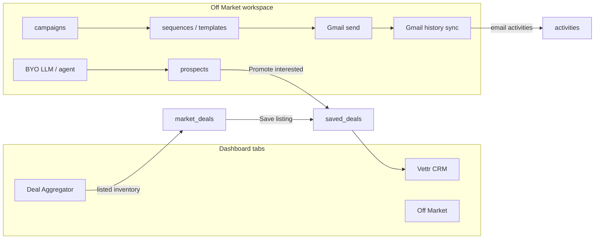

# Vettr Off Market — Campaign workspace for proprietary seller leads

## Product intent (from the operator)

Deal Aggregator is **listed inventory**. CRM is the **deal folder**. Off Market is the missing **sourcing desk**: research a vertical, run a campaign from the buyer's own inbox, see who bounced / replied / went silent, and push willing sellers into CRM for analysis.

The first version must:

1. Sit as a **third dashboard tab immediately to the right of CRM**.
2. Let the user **bring their own bot / agent / LLM** (Vettr does not host a default model).
3. Support a full campaign loop: **research verticals → customize emails → batch send → track from the user's inbox → stats**.
4. Treat Off Market as **another source of deal leads**, flowing into native CRM (`saved_deals` + contacts + activities) — not a second CRM.

Inspiration (patterns, not clones): Instantly / Lemlist campaign stats; Apollo-style list building; Streak-style inbox tracking — all constrained to **the user's Gmail** and **the user's LLM/agent**.

---

## Phase 0 — Documentation discovery (allowed APIs)

Do **not** invent new Google, CRM, or nav APIs. Copy these.

### Allowed — navigation / dashboard

| Need | Copy from |
|------|-----------|
| Tab button + order | `web/src/components/Navigation.jsx` ~183–213 (insert **after** CRM button, **before** version span) |
| Tab CSS | `web/src/styles/global.css` `.tab-navigation` ~657–707; compact three-tab note ~6763 |
| Valid tab IDs + URL | `web/src/utils/dashboardLocation.js` `VALID_TABS` L3, `patchDashboardSearchParams` L59–81 |
| Tab state + panes | `web/src/pages/DashboardPage.jsx` init L82–92, URL effect ~260–311, render ~593–690 |
| Guest CRM empty | `DashboardPage.jsx` L661–667 + `web/src/components/GuestMyDealsEmpty.jsx` |
| Object rail | `web/src/components/crm/CrmObjectNav.jsx` `NAV_ITEMS` L1–9 (copy structure, new ids) |
| UI tokens | `.cursor/skills/vettr-ui/SKILL.md` — `var(--bg-secondary)`, `.crm-*`, `.tab-btn` |

### Allowed — CRM / deals (promote path)

| Need | Copy from |
|------|-----------|
| Save proprietary deal | `web/src/components/ManualDealModal.jsx` `SOURCE_TYPES` L5–12; `dealsAPI.saveDeal` payload L74–98 (`externalSourceType: 'proprietary'`) |
| Server save | `backend/src/controllers/dealsController.js` `saveDeal` L100–115 |
| CSV off-market types | `backend/src/services/crmImportService.js` `EXTERNAL_SOURCE_TYPES` (includes `proprietary`) |
| Pipeline Inbox | `backend/src/constants/pipelineStages.js` + `web/src/utils/pipelineStages.js` |
| Activities | `POST /api/crm/deals/:id/activities` → `addDealActivity` (`crmController.js` ~350); `activity_type` is a free VARCHAR — use `'email'` / `'off_market'` |
| Contacts / companies | `backend/src/routes/crm.js` `listCrmContacts`, `postCrmContact`, `listCrmCompanies`, `postDealContactLink` |
| Schema append | `backend/src/db/migrate.js` — add a **new named migration** at the end of `migrations` (last is `saved_deal_views_v5_94` ~1195) |

### Allowed — Gmail (send now; read later)

| Need | Copy from |
|------|-----------|
| Send one message | `backend/src/services/googleGmailService.js` `sendGmailMessage(userId, { to, subject, text, html })` L53 |
| Gmail HTTP | `POST https://gmail.googleapis.com/gmail/v1/users/me/messages/send` (same file ~86) |
| OAuth scopes | `backend/src/services/googleCalendarService.js` `GMAIL_SEND_SCOPE` + `SCOPES` L8–14 |
| Scope check | `connectionHasGmailSend` L97–100 |
| Settings Google panel | `web/src/components/GoogleIntegrationsPanel.jsx` |
| Client send | `web/src/utils/api.js` `crmAPI` gmail send ~454; `IOIModal.jsx` send UX |

**Gmail read is not implemented.** History / list / get must be added in M6 using Google's documented endpoints only:

- `GET https://gmail.googleapis.com/gmail/v1/users/me/messages?q=...`
- `GET https://gmail.googleapis.com/gmail/v1/users/me/messages/{id}`
- `GET https://gmail.googleapis.com/gmail/v1/users/me/history?startHistoryId=...`
- Incremental OAuth: add `https://www.googleapis.com/auth/gmail.readonly` via existing `include_granted_scopes: 'true'` (`googleCalendarService.js` L74)

### Allowed — jobs

| Need | Copy from |
|------|-----------|
| Cron | `backend/src/services/notificationScheduler.js` (`node-cron`, `*/15` pattern ~29) |

### Allowed — settings persistence

| Need | Copy from |
|------|-----------|
| Settings page sections | `web/src/pages/SettingsPage.jsx` Google + CRM digest blocks |
| User settings JSON | `backend/src/controllers/userController.js` — **do not** store LLM API keys in `user_settings.preferences` (visible to export). New table in M3. |

### Explicitly not allowed / anti-patterns

- Do **not** upsert Off Market cold lists into `market_deals` (`UNIQUE(source, source_id)`). That table is buy-box aggregator inventory (`.cursor/rules/product-philosophy.mdc`).
- Do **not** add a CRM `crmSubview` named off-market. This is a **sibling tab**.
- Do **not** embed Twenty (`docs/crm/PHASE5_TWENTY.md`).
- Do **not** send campaign mail through Vettr SMTP (`emailService.js`). SMTP is for invites/digests. Campaigns go through **the user's Gmail**.
- Do **not** add `gmail.readonly` until M6. M5 uses existing `gmail.send` only.
- Do **not** invent Instantly-style open pixels / click tracking in v1. Stats are **sent / bounced / replied / unanswered**.
- Do **not** scrape or buy emails inside Vettr. Lists come from the user's LLM/agent/CSV.
- Do **not** auto-create CRM tasks from outreach (`docs/misc/ROADMAP.md` — parked).
- Do **not** use Alpine Coast colors; match `.tab-btn` / `.crm-*` (vettr-ui skill).
- Do **not** bump minor/major version; each shipped slice increments current **5.0.x** patch in `web/package.json` (and backend + health if API ships). Cursor `versioning.mdc` still says 4.1.x; the live line is **5.0.218 / API 5.0.116**.

---

## Honest status (today)

| Capability | Reality | Gap |
|-----------|---------|-----|
| Top-level Off Market | Only Aggregator + CRM tabs | Need third tab + pane |
| Proprietary deals | Manual add + CSV `external_source_type = 'proprietary'` | No campaign, no list, no stats |
| Email | Send-only Gmail (`gmail.send`) + Quick IOI | No batch, no templates, no inbox sync |
| LLM / agent | None | BYO connection + ingest API |
| Inbox tracking | None | Optional `gmail.readonly` + thread match |
| CRM source filter | `external_source_type` stored, barely shown | Chip + promote path |

**Keep:** `saveDeal`, ManualDealModal taxonomy, CRM contacts/companies/activities, Gmail send, Google OAuth connection, CRM object-nav chrome.

---

## Architecture decisions (locked unless the operator overrides)



1. **Third `activeTab = 'off-market'`**, JSX immediately after CRM. URL `?tab=off-market`. Guests get a signup empty state (mirror CRM).
2. **CRM-only leads, not aggregator rows.** Cold prospects live in Off Market tables. A **promote** action creates `saved_deals` with `source: 'Off Market'`, `source_type: 'off_market'`, `external_source_type: 'proprietary'`, `market_deal_id` null. Optional `referral_source` = campaign name.
3. **BYO intelligence.** Vettr stores a provider + encrypted key and/or an agent ingest token. No Vettr-billed model in v1. If nothing is connected, research is manual/CSV.
4. **Mail from the user's inbox.** Batch send wraps `sendGmailMessage`. Tracking reads the same Gmail account. Reputation and compliance stay with the user.
5. **v1 stats = delivery outcomes**, not marketing opens: `queued | sent | bounced | replied | unanswered | skipped | failed`.
6. **Personal workspace first.** Google is already per-user. Off Market v1 is `user_id`-scoped. Promote may pass `teamId` the same way `DashboardPage` saves deals (`scope: 'team', teamId: activeTeamId`).
7. **Suppression + throttle are first-class.** Daily send cap (default 50), delay between messages, per-user suppression list (unsubscribed / bounced / do-not-contact). No purchased-list tooling.
8. **Signal over noise.** Off Market lists never load into the aggregator. CRM only receives **promoted** prospects (plus optional auto-promote when reply classification = `interested` **and** the user has enabled that campaign flag — off by default).

---

## Data model (M2)

Append one migration, e.g. `off_market_v5_95`, in `backend/src/db/migrate.js`.

```sql
-- user_llm_connections: one row per user (v1)
-- provider: 'openai_compat' | 'anthropic' | 'webhook'
-- api_key_cipher BYTEA, api_key_nonce BYTEA  -- AES-256-GCM with env LLM_CREDENTIALS_KEY
-- base_url TEXT  -- OpenAI-compatible endpoint
-- model TEXT
-- ingest_token_hash TEXT  -- for agent POST ingest
-- never SELECT cipher columns in list APIs; return { connected: true, provider, model, last4 }

CREATE TABLE off_market_campaigns (
  id SERIAL PRIMARY KEY,
  user_id INTEGER NOT NULL REFERENCES users(id) ON DELETE CASCADE,
  team_id INTEGER REFERENCES teams(id) ON DELETE SET NULL,
  name TEXT NOT NULL,
  vertical TEXT,
  geography TEXT,
  brief TEXT,
  status VARCHAR(20) NOT NULL DEFAULT 'draft', -- draft|active|paused|archived
  daily_send_cap INTEGER NOT NULL DEFAULT 50,
  send_delay_sec INTEGER NOT NULL DEFAULT 90,
  auto_promote_on_interested BOOLEAN NOT NULL DEFAULT false,
  sequence_id INTEGER,
  created_at TIMESTAMPTZ DEFAULT NOW(),
  updated_at TIMESTAMPTZ DEFAULT NOW()
);

CREATE TABLE off_market_sequences (
  id SERIAL PRIMARY KEY,
  user_id INTEGER NOT NULL REFERENCES users(id) ON DELETE CASCADE,
  name TEXT NOT NULL,
  steps JSONB NOT NULL DEFAULT '[]'::jsonb
  -- steps: [{ delayDays, subject, bodyHtml, bodyText }]
);

CREATE TABLE off_market_prospects (
  id SERIAL PRIMARY KEY,
  user_id INTEGER NOT NULL REFERENCES users(id) ON DELETE CASCADE,
  campaign_id INTEGER NOT NULL REFERENCES off_market_campaigns(id) ON DELETE CASCADE,
  company_id INTEGER REFERENCES companies(id) ON DELETE SET NULL,
  contact_id INTEGER REFERENCES contacts(id) ON DELETE SET NULL,
  saved_deal_id INTEGER REFERENCES saved_deals(id) ON DELETE SET NULL,
  company_name TEXT NOT NULL,
  owner_name TEXT,
  email TEXT,
  title TEXT,
  location TEXT,
  notes TEXT,
  source_url TEXT,
  research_json JSONB DEFAULT '{}'::jsonb,
  status VARCHAR(20) NOT NULL DEFAULT 'new',
  -- new|researched|queued|contacted|replied|bounced|interested|unsubscribed|skipped|promoted
  UNIQUE (campaign_id, email) -- emails nullable: use partial unique index WHERE email IS NOT NULL
);

CREATE TABLE off_market_messages (
  id SERIAL PRIMARY KEY,
  user_id INTEGER NOT NULL REFERENCES users(id) ON DELETE CASCADE,
  campaign_id INTEGER NOT NULL REFERENCES off_market_campaigns(id) ON DELETE CASCADE,
  prospect_id INTEGER NOT NULL REFERENCES off_market_prospects(id) ON DELETE CASCADE,
  step_index INTEGER NOT NULL DEFAULT 0,
  gmail_message_id TEXT,
  gmail_thread_id TEXT,
  rfc_message_id TEXT,
  to_email TEXT NOT NULL,
  subject TEXT,
  body_text TEXT,
  status VARCHAR(20) NOT NULL DEFAULT 'queued', -- queued|sent|bounced|replied|failed
  sent_at TIMESTAMPTZ,
  last_event_at TIMESTAMPTZ,
  error TEXT,
  metadata JSONB DEFAULT '{}'::jsonb
);

CREATE TABLE off_market_suppressions (
  user_id INTEGER NOT NULL REFERENCES users(id) ON DELETE CASCADE,
  email TEXT NOT NULL,
  reason VARCHAR(30) NOT NULL, -- bounced|unsubscribed|manual
  created_at TIMESTAMPTZ DEFAULT NOW(),
  PRIMARY KEY (user_id, email)
);
```

Prospect `status` is the CRM-facing lifecycle. Message `status` is the mail event. Stats aggregate messages + latest prospect status.

---

## HTTP surface (M2+)

Mount `app.use('/api/off-market', offMarketRoutes)` in `backend/src/index.js` next to `/api/crm`. Auth: existing `authMiddleware`.

| Method | Path | Purpose |
|--------|------|---------|
| GET/POST | `/campaigns` | List / create |
| GET/PATCH | `/campaigns/:id` | Detail / pause / caps |
| GET/POST | `/campaigns/:id/prospects` | List / add (CSV or JSON) |
| POST | `/campaigns/:id/research` | Run BYO LLM research (M4) |
| POST | `/ingest/:token` | Agent push prospects (hashed token; no JWT) |
| GET/POST | `/sequences` | Templates |
| POST | `/campaigns/:id/enqueue` | Queue step 0 for eligible prospects |
| POST | `/campaigns/:id/send-tick` | Process N queued sends (also called from cron) |
| GET | `/campaigns/:id/stats` | Counts |
| POST | `/prospects/:id/promote` | Create `saved_deals` + link |
| GET/PUT | `/llm-connection` | BYO LLM (M3) |
| GET | `/gmail-status` | send + optional readonly flags |

Logging: `console.log('[off-market]', { userId, campaignId, action, ... })` on send, sync, promote, ingest.

---

## Milestone slices (ship in order)

Each slice: implement → user test checklist → bump **5.0.x** on shipped surfaces → commit.

### M0 — Confirm locked decisions

Operator review of this plan. If anything below is wrong, stop before M1:

- Tab (not CRM subview, not Settings).
- No `market_deals` for cold lists.
- BYO LLM/agent only (no Vettr-hosted model).
- Gmail of the user (not Vettr SMTP).
- Promote-to-CRM as the only path into the deal folder.

**Exit:** Written yes/no on the five bullets.

### M1 — Shell: tab + empty workspace

**What to implement (copy, don't invent)**

1. `VALID_TABS` add `'off-market'` — `dashboardLocation.js` L3.
2. `patchDashboardSearchParams`: when `tab === 'off-market'`, strip aggregator + CRM deal params the same way CRM strips `matchIds` (extend L68–80). Persist `omSubview` later; M1 can omit subview query.
3. `Navigation.jsx`: third `.tab-btn` after CRM (~208), label `Off Market`. Badge = active campaign count (0 in M1).
4. `DashboardPage.jsx`: parse `tab=off-market` in init L82–92; `handleTabChange`; pane `{activeTab === 'off-market' && (isGuest ? <GuestOffMarketEmpty /> : <OffMarketDashboard />)}`. Copy guest CRM gate L661–667.
5. New `web/src/components/off-market/OffMarketDashboard.jsx` + `OffMarketNav.jsx` copying `CrmObjectNav` items: Campaigns, Research, Prospects, Sequences, Stats. M1 renders empty states with one-line purpose copy.
6. `guestEntitlements.js`: add signup reason `off_market` (copy `save` copy pattern L16).
7. Compact CSS already assumes three tabs (`global.css` ~6763) — verify; do not invent a fourth visual system.

**Verification**

- `/dashboard?tab=off-market` shows the pane; back/forward keeps tab.
- Guest sees signup empty, not APIs.
- CRM and Aggregator still work; version span still `margin-left: auto`.
- `node --check` N/A (Vite JSX). `npm run build` in `web/` succeeds.

**Anti-patterns:** new route like `/off-market` (stay on `/dashboard`); putting Off Market under Settings; hiding the tab instead of guest-empty (CRM is visible to guests).

### M2 — Schema + campaigns/prospects CRUD

**What to implement**

1. Migration `off_market_v5_95` at end of `migrate.js` (after L1214). Follow `crm_core_tables_v5` CREATE style (~431).
2. `backend/src/routes/offMarket.js` + controller/service split like `crmOrganizeController.js`.
3. Web: Campaigns list (cards using `.crm-*` panel tokens), create campaign (name, vertical, geography, brief, caps), prospect table for one campaign, CSV upload reusing column heuristics from `crmImportService.js` (company, owner, email, notes) — **do not** create `saved_deals` on import.
4. Upsert CRM `companies` / `contacts` when email/name present (`postCrmCompany` / `postCrmContact` pattern) **without** `deal_contacts` until promote.

**Verification**

- Restart API; migration log `off_market_v5_95 completed`.
- Create campaign, add 3 prospects, reload — rows persist.
- Duplicate email in same campaign → unique conflict, not a second row.
- `GET /api/off-market/campaigns` 401 without cookie.

**Anti-patterns:** writing `market_deals`; storing prospects only in localStorage; importing CSV through `POST /api/crm/import/csv` (that creates deals).

### M3 — BYO LLM / agent

**What to implement**

1. Settings section **AI / Agent** beside Google (`SettingsPage.jsx` ~520, copy `GoogleIntegrationsPanel` layout).
2. `user_llm_connections` + `LLM_CREDENTIALS_KEY` (32-byte key, AES-256-GCM). There is **no** existing encrypt helper in `backend/` — add `backend/src/lib/secretBox.js` (small, testable). Never return the raw key; return `last4`.
3. Providers:
   - `openai_compat`: `POST {base_url}/chat/completions` with user's key (`Authorization: Bearer`). Default base `https://api.openai.com/v1`.
   - `anthropic`: `POST https://api.anthropic.com/v1/messages` with `x-api-key`.
   - `webhook` / agent: user copies ingest URL `https://<api>/api/off-market/ingest/<token>` and POSTs `{ campaignId, prospects: [...] }`.
4. Test connection button: one tiny completion `{"ok":true}` JSON.

**Verification**

- Save key → GET connection shows provider + last4, not the key.
- Settings export (`SETTINGS_KEYS` in `SettingsPage.jsx`) still has **no** LLM secret.
- Bad key → 400 with `[off-market] llm test failed`.

**Anti-patterns:** putting keys in `user_settings.preferences`; calling OpenAI with a Vettr env key; logging the API key.

### M4 — Vertical research

**What to implement**

1. Research subview: campaign brief (vertical, geo, size, keywords, exclusions) + **Generate list** (LLM) / **Import CSV** / **Agent ingest**.
2. Server prompt (fixed template in `backend/src/services/offMarketResearchService.js`) asks the model for JSON `{ prospects: [{ company_name, owner_name, email, title, location, notes, source_url }] }`. Parse JSON only; drop rows without `company_name`. Email may be null (status `researched`).
3. Cap generated rows (e.g. 25 per click) so a bad prompt cannot dump thousands.
4. User edits rows before they enter the sendable pool (`status: new` → user marks `researched` or adds email).

**Verification**

- With no LLM connection, Generate is disabled with a Settings link; CSV still works.
- With a mock/webhook, 5 JSON prospects appear on the campaign.
- Empty email rows are visible but not enqueueable.

**Anti-patterns:** Vettr crawling the public web itself; treating LLM output as verified emails; auto-enqueuing generated rows.

### M5 — Customize + batch send (Gmail send only)

**What to implement**

1. Sequence editor: 1–3 steps, `{{first_name}}`, `{{company}}`, `{{vertical}}`, `{{sender_name}}`. Preview on a selected prospect.
2. Extend `sendGmailMessage` **or** add `sendGmailCampaignMessage` in the **same file** that still hits `users/me/messages/send`, adding `In-Reply-To` / thread for step 2+. Store returned `id` + `threadId`.
3. Enqueue + send-tick: skip suppression table; skip missing email; honor `daily_send_cap` and `send_delay_sec`. Cron every 5 minutes in `notificationScheduler.js` (copy 15-min job style).
4. UI: per-campaign “Start sending” / Pause. Progress: sent / remaining / failed.

**Verification**

- Without Google: CTA to Settings (copy `IOIModal.jsx` gmail connect hint ~520).
- With Gmail: one test send to the user's own address; `off_market_messages.status = sent` and Gmail shows it **from the user**.
- Cap 2/day: third enqueue stays queued.
- Suppression email never sends.

**Anti-patterns:** SMTP fallback for campaigns; CC/BCC to Vettr; sending HTML without a text part; unbounded parallel sends.

### M6 — Inbox tracking + stats

**What to implement**

1. Incremental Google reconnect: add `gmail.readonly` to `SCOPES` **or** a second “Enable inbox tracking” button that requests the extra scope (`include_granted_scopes` already true). Update `GoogleIntegrationsPanel` copy (today: “send IOIs” L105–107).
2. After send, save `gmail_thread_id`. Sync job lists thread messages; classify:
   - **bounced:** from `mailer-daemon` / `postmaster` / `X-Failed-Recipients`
   - **replied:** any message in thread `From` matches prospect email (not the user)
   - **unanswered:** sent and no reply/bounce after campaign SLA (default 14 days) — computed, not a stored exclusive state
3. Optional LLM classify of reply body → `interested | not_interested | ooo | other` stored on prospect `research_json` / status. Default off if no LLM.
4. Stats view: copy CRM analytics layout (`CrmDashboard` analytics subview): bars for sent/bounced/replied/unanswered/interested. No open-rate.

**Verification**

- Reply from a second account on a test thread flips prospect to `replied` after sync.
- Bounce mailbox (or a fixture test with a stored MIME) → `bounced` + suppression row.
- Users who never grant readonly still send; stats show sent/failed only, with a connect banner.

**Anti-patterns:** `gmail.modify` (not needed); polling full mailbox; storing full MIME forever (store ids + snippet + classification); open pixels.

### M7 — Promote into Vettr CRM

**What to implement**

1. `POST /prospects/:id/promote` calls the same insert path as `saveDeal` (`dealsController.js` L100+) with:
   - `dealId = offm_${prospect.id}`
   - `name` = company_name
   - `source: 'Off Market'`
   - `sourceType: 'off_market'`
   - `externalSourceType: 'proprietary'`
   - `referralSource` = campaign name
   - `industry` = campaign.vertical
   - `notes` = research notes + last reply snippet
   - `teamId` from active team if Dashboard is in team mode
2. Link `contacts` with role `'seller'` via `postDealContactLink` (default role in DB is `'broker'` — pass `'seller'`).
3. Copy message timeline into `activities` (`activity_type: 'email'`, metadata `{ gmailThreadId, offMarketMessageId }`).
4. Set `prospects.saved_deal_id` and `status = 'promoted'`. CRM deep link: existing `crmDealPath` in `web/src/utils/notificationLinks.js`.
5. CRM: show source chip when `source === 'Off Market'` on cards/list (today source is underused — `CrmDealWorkspace.jsx` ~395). Optional saved-view filter tag `off-market`.
6. Auto-promote only if `auto_promote_on_interested` (default false).

**Verification**

- Promote → deal appears in CRM Inbox (`__unstaged__`) with contact + email activity.
- Aggregator counts unchanged.
- Second promote of same prospect is idempotent (same `deal_id`).
- Opening the CRM deal from Off Market uses `?tab=crm&crmDeal=`.

**Anti-patterns:** creating `market_deals` so aggregator “has a source”; putting 500 cold emails into CRM; auto-promote on any reply.

---

## Off Market UI map (M1 nav)

| Subview | Job |
|---------|-----|
| Campaigns | List + status + caps (home) |
| Research | Vertical brief + generate/import |
| Prospects | Table: company, owner, email, status, last event |
| Sequences | Templates + merge preview |
| Stats | Campaign funnel |

Match `CrmDashboard` + `CrmObjectNav`. Empty states should tell the user the loop: research → write → send from Gmail → promote replies to CRM.

---

## Compliance / safety (product rules, not legal advice)

- User sends as themselves; Vettr is the dashboard + API client.
- Require a visible opt-out line in the default template (`Reply STOP` / `please don't contact me again` → suppression).
- Hard-block send if daily cap exceeded or address is suppressed.
- Log every send with prospect id (debug without logging full bodies in production if oversized).
- Research output is unverified — UI copy: “Confirm emails before sending.”

---

## Explicitly out of scope (v1)

- Hosted Vettr LLM / usage billing
- Email finding / waterfall enrichment / LinkedIn
- Open/click pixels, A/B subject tests, dedicated sending domains
- IMAP/Outlook (Gmail first; other providers later)
- Chrome extension Off Market (`deals-dashboard.js` manual entry stays as-is)
- Writing Off Market rows into Deal Aggregator / `market_deals`
- Twenty embed / Gmail threading inside the CRM deal workspace (Phase 5 still deferred; Off Market owns outreach threads)
- Auto tasks from replies (ROADMAP parked)

---

## Engineering notes

- **UI:** vettr-ui skill; copy `.tab-btn` and `.crm-object-nav`. Mobile compact tabs already mention three buttons.
- **Version:** bump 5.0.x per shipped slice (`web/package.json` for tab-visible; backend + `index.js` health when API changes).
- **Tests:** no app test runner. Per slice: `node --check` new backend files; `npm run build` in `web/`; curl happy-path; browser pass on tab + one campaign flow.
- **Logging:** `[off-market]` prefix; `[google]` already used for OAuth.

---

## Success metric

A buyer can: connect Gmail + (optional) LLM → research or paste a 20-row vertical list → send a personalized first-touch from their inbox → see bounce/reply/unanswered counts → promote a yes into CRM Inbox as source **Off Market**, with the email thread on the deal.

---

## Process

Approve this plan (M0) → implement M1 → user tests the tab → then M2…M7. Do not start Gmail readonly or CRM promote until send + lists work.

### User testing (after each slice)

Use `.cursor/skills/interactive-testing-checklist/SKILL.md` when a slice ships. Suggested M7 checklist:

- [ ] Off Market tab sits to the right of CRM
- [ ] Guest sees signup empty state
- [ ] Campaign + CSV prospects persist
- [ ] BYO LLM key stores without appearing in Settings export
- [ ] Batch send uses my Gmail, respects cap
- [ ] Reply/bounce show on Stats
- [ ] Promote creates a CRM deal tagged Off Market with contact + activity
- [ ] Deal Aggregator is unchanged
